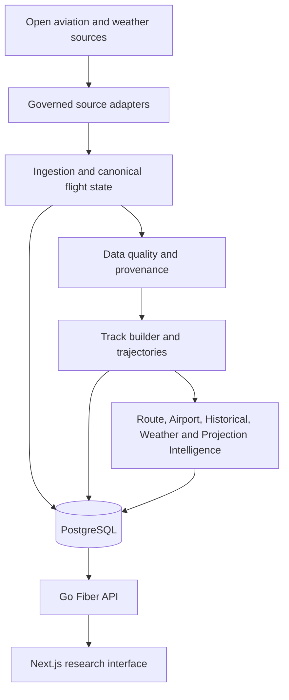

# Global Flight Analytics

[](https://github.com/AsifAbbasov/global-flight-analytics/actions/workflows/backend-ci.yml)
[](https://github.com/AsifAbbasov/global-flight-analytics/actions/workflows/frontend-ci.yml)

Global Flight Analytics is a full-stack open-data aviation research platform built to
show how production engineering, data quality, temporal analytics and explainable
inference can coexist in one coherent product.

It is not air traffic control, navigation guidance, ticketing, a commercial flight
status service or regulated aviation software. Every analytical surface keeps its data
window, confidence, provenance and limitations visible.

<!-- RELEASE-PORTFOLIO-CLOSURE-V1 -->
<!-- BACKEND-OPERATIONS-EVIDENCE-CLOSURE-V1 -->
<!-- RELEASE-TRUTH-DEPLOYMENT-REVISION-V1 -->
## Portfolio Release Status

Source implementation and exact-commit Continuous Integration are closed for the original
portfolio release `49e474e929dcca5b687464f0a47ce73fcd5a52a7`:

- Backend CI run `30715613342` completed successfully;
- Frontend CI run `30715613361` completed successfully.

The production verification completed on 2026-08-02 used application revision
`6bca02a8ed1487195b165ae9ced3ca687a373666`. This is immutable historical evidence for that verification event,
not a claim that the mutable production aliases still serve the same revision:

- Frontend: `https://global-flight-analytics-web.vercel.app`
- API: `https://global-flight-analytics-api.onrender.com`
- Database: owner-controlled Neon PostgreSQL

Production migrations `019` through `029` were applied through the direct TLS Neon
workflow. Render uses the pooled Neon connection string, and Vercel uses the public Render
API origin. The exact Vercel origin is configured in Render Cross-Origin Resource Sharing.

Verified production evidence:

```text
PRODUCTION_DATABASE_MIGRATION=PASS
PRODUCTION_API_SMOKE=PASS
PRODUCTION_FRONTEND=PASS
PRODUCTION_API_HEALTH=PASS
PRODUCTION_API_READINESS=PASS
PRODUCTION_API_VERSION=PASS
PRODUCTION_CORS=PASS
PRODUCTION_RELEASE_SMOKE=PASS
```

Visual and interaction redesign remains a separate product phase. The current frontend is
publicly deployed and technically integrated, but it is not presented as the final visual
design. Live URLs and green checks are recorded only because they were verified against the
exact revisions documented in the release closure.

## What Is Implemented

### Product experience

- live regional and world traffic exploration;
- synchronized map, aircraft index and detail intelligence;
- Airport Intelligence ranking, digital passport, completed-day history and trends;
- Historical Intelligence across global, airport and route scopes;
- previous-period and persisted-record comparison;
- browser-side snapshot data-quality evidence;
- deterministic CSV and GeoJSON research exports;
- shareable workspace state and explicit live-refresh controls;
- responsive navigation, keyboard access, offline awareness and recoverable errors.

### Analytical platform

- canonical flight-state normalization and PostgreSQL persistence;
- provider budgets, health-aware selection, retry, fallback and ingestion evidence;
- trajectory construction, segmentation, reconciliation and quality contracts;
- Route Intelligence with evidence, confidence and limitations;
- Airport, Historical, Weather, Projection and Stability Intelligence;
- materialized analytical records with versioned contracts and provenance;
- read-snapshot consistency, nullable telemetry integrity and exact pagination.

### Engineering depth

- Go modular monolith with explicit bounded contexts;
- PostgreSQL migrations, constraints, repositories and repeatable-read boundaries;
- Next.js, TypeScript, TanStack Query, MapLibre and dependency-free contract tests;
- non-root scratch container with build provenance and lifecycle health checks;
- protected mutation routes and unauthenticated read-only research routes;
- deterministic dependency policy, vulnerability checks and architecture audits;
- rollback-safe incremental installers and exact changed-file manifests.

## Architecture



The production architecture is a modular monolith, not a collection of premature
microservices. The backend is the single authority for persistence and analytical
semantics; the frontend validates transport contracts and renders evidence without
recomputing server-owned metrics.

## Technology

| Layer | Technology |
| --- | --- |
| Frontend | Next.js 16, React 19, TypeScript, TanStack Query, MapLibre, Three.js |
| Backend | Go, Fiber, pgx |
| Database | PostgreSQL |
| Local runtime | Docker Compose |
| Production path | Vercel frontend, Render Docker API, Neon PostgreSQL |
| Quality gates | Go tests and vet, architecture audits, Node contract tests, ESLint, TypeScript, production builds, dependency policy |

<!-- RECRUITER-QUICKSTART-V1 -->
## Run the Local Demo

### Prerequisites

- Docker with Compose version 2;
- Node.js 24.9.0;
- pnpm 11.8.0;
- Go version declared by `apps/api/go.mod` for backend development.

Start PostgreSQL, migrations and the API from the repository root:

```bash
docker compose config
docker compose up --build --detach
docker compose ps
```

Verify the real backend lifecycle endpoints:

```bash
curl --fail --silent --show-error http://127.0.0.1:8080/api/v1/health
curl --fail --silent --show-error http://127.0.0.1:8080/api/v1/ready
curl --fail --silent --show-error http://127.0.0.1:8080/api/v1/version
```

Start the typed Next.js frontend in a second terminal:

```bash
pnpm install --frozen-lockfile
test -f apps/web/.env.local || cp apps/web/.env.example apps/web/.env.local
pnpm dev:web
```

Open `http://localhost:3000`. The frontend reads the local Go API through
`NEXT_PUBLIC_API_BASE_URL=http://localhost:8080`.

Stop the environment while preserving PostgreSQL data:

```bash
docker compose down
```

Use `docker compose down --volumes` only when a clean local database is intended.
The Compose mutation-key digest is a local startup default with no raw key shipped;
state-changing routes remain inaccessible until a developer supplies their own secret.

## Verify a Release Candidate

Run the complete reviewer-oriented source gate:

```bash
pnpm verify:release
```

The command verifies the portfolio contract, recruiter quickstart, frozen dependency
graph, frontend tests, ESLint, TypeScript, production build, Go formatting, Go tests,
Go vet, core architecture audits, Docker Compose configuration and whitespace integrity.
The much broader PostgreSQL, race, container and domain audit matrix remains enforced by
the existing GitHub Actions workflows.

Validate the verified public frontend and API together:

```bash
DEPLOYED_API_REVISION='<full SHA from the intended Render deployment>'
FRONTEND_URL="https://global-flight-analytics-web.vercel.app" \
API_BASE_URL="https://global-flight-analytics-api.onrender.com" \
EXPECTED_API_REVISION="$DEPLOYED_API_REVISION" \
pnpm smoke:production
```

## Prepare and Verify the Production API

Validate repository-side backend operations:

```bash
pnpm test:backend-operations-contract
pnpm verify:backend-operations-contract
```

Run production migrations against the direct Neon connection string:

```bash
PRODUCTION_DATABASE_MIGRATION_URL='paste the direct Neon URL in this terminal only' \
EXPECTED_RELEASE_SHA="$(git rev-parse HEAD)" \
pnpm migrate:production-database
```

After the CI-gated Render API deploy completes, verify lifecycle and build provenance:

```bash
DEPLOYED_API_REVISION='<full SHA from the intended Render deployment>'
API_BASE_URL="https://global-flight-analytics-api.onrender.com" \
EXPECTED_API_REVISION="$DEPLOYED_API_REVISION" \
pnpm smoke:api-production
```

The full `pnpm smoke:production` browser and CORS contract has been executed successfully
against the stable Vercel and Render production origins. Future application revisions must
repeat the same revision-specific verification.

## Reviewer Guide

- [`docs/162_RELEASE_AND_PORTFOLIO_CLOSURE.md`](docs/162_RELEASE_AND_PORTFOLIO_CLOSURE.md) — release definition and production evidence policy;
- [`docs/163_PRODUCTION_DEPLOYMENT_RUNBOOK.md`](docs/163_PRODUCTION_DEPLOYMENT_RUNBOOK.md) — Neon, Render and Vercel deployment path;
- [`docs/164_RECRUITER_DEMO_SCRIPT.md`](docs/164_RECRUITER_DEMO_SCRIPT.md) — seven-minute product and code walkthrough;
- [`docs/165_SYSTEM_ARCHITECTURE_AND_DECISIONS.md`](docs/165_SYSTEM_ARCHITECTURE_AND_DECISIONS.md) — architecture, boundaries and trade-offs;
- [`docs/166_BACKEND_OPERATIONS_AND_CI_EVIDENCE_CLOSURE.md`](docs/166_BACKEND_OPERATIONS_AND_CI_EVIDENCE_CLOSURE.md) — verified backend operations and cloud evidence;
- [`docs/169_RELEASE_TRUTH_AND_DEPLOYMENT_REVISION_CLOSURE.md`](docs/169_RELEASE_TRUTH_AND_DEPLOYMENT_REVISION_CLOSURE.md) — historical-versus-current deployment revision contract;
- [`docs/DOCUMENT_INDEX.md`](docs/DOCUMENT_INDEX.md) — complete engineering record.

## Evidence Boundaries

The project uses open and incomplete observations. It does not invent filed flight plans,
confirmed incidents, operational airport capacity, safety guarantees or authoritative
flight status. Missing evidence remains missing; unavailable comparisons are not converted
into zero; optional identity fields do not invalidate positional evidence.

Machine learning, satellite fusion, fuel and emissions analytics, billing, authentication,
push notifications, Kubernetes and microservices remain outside the portfolio MVP.

<!-- SOURCE-CONSTRAINTS-OPENSKY-V1 -->
## Free Data and Evidence Boundaries

The immutable project constraints and OpenSky integration boundary are documented in:

```text
docs/36_FREE_DATA_SOURCE_AND_EVIDENCE_BOUNDARIES.md
```

Executable enforcement lives in `apps/api/internal/analytics/sourceconstraints`.
The bounded OpenSky REST contract foundation lives in `apps/api/internal/integrations/opensky`.

<!-- OPENSKY-VALIDITY-ATTRIBUTION-V1 -->
### OpenSky temporal validity and publication boundary

OpenSky is an optional external research provider, not project-owned surveillance infrastructure. Public outputs using OpenSky data must preserve the required provider citation and non-commercial research scope. State Vector fields may have different source timestamps; a position is accepted as provider-valid only within the documented fifteen-second reuse window. Access from large cloud-hosting IP ranges is not guaranteed, so OpenSky must remain behind provider health, budget, and fallback controls.

<!-- OPENSKY-PRODUCTION-PROVIDER-V1 -->
## Selectable production traffic provider

The ingestion daemon can use either `airplanes.live` or OpenSky through the same provider budget, request coalescing, health, data quality, and trajectory pipeline. `airplanes.live` remains the default. OpenSky is enabled explicitly with `TRAFFIC_PROVIDER=opensky` and remains bounded by the free-data and non-commercial research constraints.

<!-- TRAFFIC-PROVIDER-AUTOMATIC-FALLBACK-V1 -->
### Automatic free-provider fallback

`TRAFFIC_PROVIDER=auto` enables an ordered, budget-aware fallback from
`airplanes.live` to OpenSky. The secondary provider is called only after a
recoverable primary failure or access denial. Successful ingestion runs and
canonical states preserve the provider that actually supplied the data.
See `docs/38_TRAFFIC_PROVIDER_AUTOMATIC_FALLBACK.md`.

<!-- OPENSKY-REST-COMPATIBILITY-V1 -->
## OpenSky REST compatibility

Production OpenSky State Vector requests include `extended=1`. The parser accepts both the seventeen-field base representation and the eighteen-field extended representation without inventing a provider category.

<!-- OPEN-AVIATION-RESEARCH-EVIDENCE-V1-2:README -->

## Open Aviation Research Evidence Foundation

The backend now preserves transponder and OpenSky observation metadata in the canonical `FlightState`, provides research-only Transponder Alert Evidence, and enforces bounded offline manifests for selected external aviation research datasets. Satellite ADS-C evidence, automatic bulk imports, confirmed-incident claims, and production dependencies remain blocked.

<!-- STAGE-14-1-ARCHITECTURE-CONSOLIDATION-V1-1:README -->

## Architecture Consolidation

Stage 14 establishes one shared confidence vocabulary, checks Go and TypeScript trajectory contracts, audits analytical package reachability from real runtime roots, and adds supply-chain quality gates. Packages are not deleted until the reachability report distinguishes production, operational, verification, offline research, and genuinely obsolete code.

The Stage 14 migration closure also executes the complete production catalog against clean PostgreSQL. Migration identities must be canonical, unique, and contiguous; Data Quality parent integrity owns version 019 while the earlier Flight State observation metadata migration retains version 016.

<!-- STAGE-14-2-DEAD-CODE-CLASSIFICATION:README -->

## Dead Code Classification

Stage 14.2 removes the obsolete `analytics/query` and `analytics/window` foundation packages after importer proofs. Every remaining analytical package outside production runtime now requires an explicit disposition and next action; unknown non-runtime packages fail strict project audit.

<!-- STAGE-14-3-AIRPORT-INTELLIGENCE-PRODUCTION:README -->

## Airport Intelligence Production API

Airport Passport, Statistics, Ranking, Overview, History, and Trends are composed through a PostgreSQL-backed read-only production service. The API uses completed Coordinated Universal Time days and exposes explicit open-data limitations.

<!-- STAGE-14-4-FEATURE-MATERIALIZATION:README -->

## Flight Feature Materialization

Persisted trajectories can now be processed through the complete Feature Pipeline with `materialize-flight-features`. The command uses real PostgreSQL trajectory and aircraft data and stores idempotent snapshots in `flight_feature_snapshots`. The isolated in-memory dataset profiler was removed rather than falsely connected.

<!-- STAGE-14-5-MUTATION-ENDPOINT-PROTECTION:README -->

## Mutation Endpoint Protection

Public read routes remain unauthenticated. Every state-changing or computation-triggering HTTP route requires the backend-only `X-Internal-API-Key` header. The backend stores only `API_MUTATION_KEY_SHA256`, compares presented credentials in constant time, and refuses database-backed production configuration without the digest.

<!-- STAGE-14-6-FORMULA-BENCHMARK:README -->

## Formula Benchmark and Calibration Gate

Projection formulas can now be evaluated through a bounded offline command that consumes an approved research dataset manifest and an immutable Projection Evaluation aggregate. Reports distinguish insufficient evidence, failed gates, and passed gates while permanently prohibiting automatic formula changes or calibration claims.

<!-- STAGE-14-7-FRONTEND-DEPENDENCY-SECURITY:README -->

## Frontend Dependency Security

The pnpm workspace now redirects PostCSS versions below 8.5.10 to 8.5.15, verifies the committed dependency graph without network access, and blocks moderate or more severe production dependency findings in frontend continuous integration.

<!-- STAGE-14-8-SERVER-COMPOSITION-ROOT-DECOMPOSITION:README -->

## Server Composition Root Decomposition

Database-backed server wiring is now organized by bounded context. The coordinator describes startup order, composition files construct dependencies, and route files register HTTP topology. Existing methods, paths, contracts, and mutation protection remain unchanged.

<!-- STAGE-14-9-HTTP-QUERY-CONTRACT-BOUNDARY:README -->

## Historical Intelligence Contract Boundary

Historical Intelligence HTTP handlers and DTO conversion now depend on a pure aggregate store contract rather than the PostgreSQL implementation. Latest and history query parsing use separate intent-revealing functions without boolean mode arguments.

<!-- STAGE-14-10-TRANSPONDER-EVIDENCE-PRODUCTION:README -->

## Transponder Evidence Production API

The production server now exposes the latest persisted special transponder code as read-only research evidence. Responses explicitly state that the observation is evidence-only, does not confirm an emergency, and is not an operational alert.

<!-- STAGE-14-11-TARGETED-LARGE-MODULE-HARDENING:README -->

## Targeted Large-Module Hardening

Historical and Route Intelligence validation are divided by contract responsibility. Projection continuation and estimated-arrival public methods are narrow coordinators, while detailed preparation, computation, fallback, confidence, provenance, and result construction remain isolated and testable.

<!-- STAGE-14-12-PROJECTION-READ-SNAPSHOT-CONSISTENCY:README -->

## Projection Read Snapshot Consistency

One Projection Intelligence result now loads its current trajectory, route, historical candidates, and route-frequency history through one PostgreSQL read-only repeatable-read snapshot. Concurrent ingestion or materialization cannot make different input queries observe different committed database states.

<!-- STAGE-14-13-NULLABLE-TELEMETRY-INTEGRITY:README -->

## Nullable Telemetry Integrity

Projection Intelligence no longer converts absent coordinates, motion telemetry, or on-ground state into plausible zero or false values. Only complete required kinematic observations become analytical trajectory points; legitimate stored zero values remain valid.

<!-- STAGE-14-14-COMPOSITE-HISTORICAL-PAGINATION-V3:README -->

## Lossless Historical Pagination

Historical Intelligence history now uses a versioned opaque `cursor` token that carries the complete PostgreSQL ordering boundary: window end, window start, as-of time, and record identifier. Store, HTTP response, handler parsing, and runtime verification use the same lossless keyset contract.

<!-- STAGE-14-15-WEATHER-COMPOSITION-BOUNDARY:README -->

## Weather Composition Boundary

Weather production wiring now separates provider governance and integration, PostgreSQL-backed application construction, dependency coordination, and Fiber route registration. The current weather endpoint and runtime dependency graph remain unchanged.

<!-- BACKEND-FINAL-CORRECTNESS-AUDIT:README -->

## Backend Final Correctness Audit

The repository now includes a permanent backend correctness gate for Projection read snapshot consistency, nullable telemetry integrity, Historical pagination, and Weather composition. Run `scripts/verify-backend-final-correctness.sh` before backend release or architecture-sensitive changes.

<!-- STAGE-14-16-END-TO-END-TELEMETRY-AVAILABILITY:README -->

## End-to-End Telemetry Availability

Flight State now preserves velocity, heading, vertical-rate, and on-ground availability from provider mapping through PostgreSQL persistence and downstream analytical reads. Missing provider telemetry remains `NULL`; real zero values remain valid observations.

<!-- STAGE-14-29-MIGRATION-CATALOG-INTEGRITY:README -->

## Stage 14 Migration Catalog Integrity

The duplicate PostgreSQL migration version `016` is removed by assigning Data Quality
Parent Integrity to canonical migration `019`. The production `cmd/migrate` path is now
part of the permanent PostgreSQL gate. Stage 14 remains reopened while the remaining
correctness and maintainability debts are addressed through separate verified increments.

<!-- STAGE-14-30-POSTGRES-CORRECTNESS-HARDENING:README -->

## Stage 14 PostgreSQL Correctness Hardening

Migration 020 now enforces Ingestion Run evidence consistency and exact timestamp
mirror contracts for Route and Historical results. Transactional repository writes use
an independent bounded rollback context. Stage 14 remains reopened for the separate
maintainability and Clean Code backlog recorded in Document 72.

<!-- STAGE-14-31-POSTGRES-WRITE-REPOSITORY-DECOMPOSITION:README -->

## Stage 14 PostgreSQL Write Repository Decomposition

Airport Import and Flight State PostgreSQL write paths now keep transaction coordination
separate from staging, merge, validation, mapping, and insert ownership. Permanent Go parser
and Stage 14 audit gates prevent the coordinator methods from becoming monoliths again.
Stage 14 remains reopened for the separate Airport pagination contract.

<!-- STAGE-14-32-AIRPORT-KEYSET-PAGINATION:README -->

## Stage 14 Airport Keyset Pagination

Airport reads now expose bounded keyset pages ordered by the complete `(name, id)` key.
The legacy complete-list method delegates to those pages, and `ListPage` plus `GetByICAO`
share one canonical row scanner. Stage 14 remains reopened for the remaining recorded scope.

<!-- STAGE-14-33-EXPLICIT-REPOSITORY-CONTEXT-AND-TRAJECTORY-WRITE-MODE:README -->

## Stage 14 Explicit Repository Context and Trajectory Write Mode

Database-reaching Airport, Flight State, and Trajectory repository paths now reject a nil
caller context instead of silently inventing `context.Background()`. Trajectory persistence
uses an explicit live or reconciled write request rather than an empty task identifier as a
hidden mode switch. Stage 14 remains reopened for the remaining recorded scope.

<!-- STAGE-14-34-POSTGRESQL-CONTRACT-CONSOLIDATION:README -->

## Stage 14 PostgreSQL Contract Consolidation

Migration repair now derives its anchor checksum and later-version boundary from a repair
plan. Repository nullable arguments are concrete driver values, missing source evidence fails
closed instead of becoming `unknown`, and UUID array queries keep UUID columns typed. Stage 14
remains reopened for trajectory profiling and the final closure audit.

<!-- STAGE-14-35-TRAJECTORY-QUERY-CONSOLIDATION-AND-PROFILING:README -->

## Stage 14 Trajectory Query Consolidation and Profiling

Trajectory parent, analytical, segment, and coverage-gap reads now share canonical SQL and dedicated row scanners. Every Trajectory read boundary preserves caller-owned context. Migration 021 adds order-aligned parent indexes, retires one duplicate segment index, and a permanent EXPLAIN ANALYZE gate verifies index eligibility. Stage 14 remains reopened only for the independent final closure audit.

<!-- STAGE-14-36-FINAL-CLOSURE:README -->

## Stage 14 Final Closure

Stage 14 is closed. The independent closure increment reruns the complete source, backend,
race, security, PostgreSQL, Trajectory profiling, frontend production, Docker image, and
container health gates after Stage 14.35 is already committed. The authoritative machine
status is `STAGE_14_OVERALL_STATUS=CLOSED`.

<!-- POST-CLOSURE-MIGRATOR-CONTEXT-HARDENING:README -->

## Post-Closure Migrator Context Hardening

The PostgreSQL migrator now rejects a nil caller context at every public database-reaching
operation and at the advisory-lock boundary. Independent bounded cleanup contexts remain for
rollback, advisory-lock release, and forced connection close. Stage 14 remains closed.

<!-- TRUSTED-PROXY-BUILD-METADATA-CLOSURE:README -->

## Trusted proxy identity and build provenance

The API ignores forwarded client-address headers unless
`API_TRUSTED_PROXY_RANGES` explicitly identifies the transport proxy.
`API_CLIENT_IP_HEADER` supports `X-Forwarded-For`, `X-Real-IP`, and
`CF-Connecting-IP`. A trusted forwarded chain is evaluated from right to left;
untrusted peers and malformed chains fall back to the direct transport address.

Container builds accept `APP_VERSION`, `VCS_REF`, and `BUILD_DATE`. The values
are embedded into the server binary, exposed by `/api/v1/version`, and mirrored
in Open Container Initiative image labels. See
`docs/95_TRUSTED_PROXY_AND_BUILD_METADATA_CLOSURE.md`.
<!-- ANALYTICAL-CORE-REVIEW-CLOSURE:README -->

## Analytical Core Review Closure

The original Analytical Core Foundation review is closed. Documents 97 through
102 form the evidence register. Production metrics use eligible contributors,
server-owned geographic and quality evidence, strict provenance, canonical
identifiers, safe failures and one canonical Metric ID namespace.

```text
ANALYTICAL_CORE_REVIEW_STATUS=CLOSED
Original findings: 19
Open required changes: 0
Deferred findings: 0
Unclassified findings: 0
```

`go run ./apps/api/tools/analyticalcorefinalaudit -strict` is the permanent
source-level closure gate.
<!-- NEXT-16-2-11-SECURITY-CLOSURE:README -->

## Next.js 16.2.11 Security Closure

The frontend pins Next.js and eslint-config-next 16.2.11 and PostCSS 8.5.18. This release is the
minimum accepted security baseline after the July 21, 2026 Next.js advisories.
The frontend dependency policy, Analytical Core closure audit, pnpm production
audit, Backend Continuous Integration, and Frontend Continuous Integration all
protect this boundary.

```text
NEXT_SECURITY_BASELINE=16.2.11
POSTCSS_SECURITY_BASELINE=8.5.18
FRONTEND_PRODUCTION_AUDIT_REQUIRED=true
```
<!-- FEATURE-PIPELINE-CONTRACT-INTEGRITY:README -->

## Feature Pipeline Contract Integrity

The production feature materializer is runtime-reachable. The pipeline now
depends on a narrow writer, rejects nil contexts and typed-nil dependencies,
validates complete report evidence, returns stored features as the only
successful source of truth, rejects ambiguous PostgreSQL wiring, and runs its
PostgreSQL verifier in Continuous Integration.

Processing identity remains a separate schema-level increment.
<!-- FEATURE-SNAPSHOT-PROCESSING-IDENTITY:README -->

## Feature Snapshot Processing Identity

Feature snapshots are keyed by trajectory, schema version, processing version
and as-of time. Existing rows are backfilled as legacy processing output.
<!-- FEATURE-PROCESSING-IDENTITY-POSTGRES-LIST-FIX:README -->

## Feature Processing Identity PostgreSQL List Correction

The non-cursor PostgreSQL feature-snapshot list query now filters by processing
version and binds its sentinel limit through a separate placeholder.
<!-- FEATURE-PROCESSING-IDENTITY-TEST-FIXTURE:README -->

## Feature Processing Identity Test Fixture Alignment

The isolated PostgreSQL feature-store integration fixture now owns the same
processing-version column and uniqueness identity as the production schema.
<!-- FEATURE-PIPELINE-FINAL-REVIEW-CLOSURE:README -->

## Feature Pipeline Durable Validation Audit and Final Review Closure

Feature snapshots now retain the complete validation report in durable payloads.
Legacy rows are explicitly marked unavailable, PostgreSQL enforces report
presence and status consistency, and every original Feature Pipeline finding has
a final implemented, rejected or deliberately retained disposition.

<!-- EXTRACTOR-COMPOSITION-PROCESSING-IDENTITY:README -->

## Extractor Composition Processing Identity

Flight feature fingerprints now bind the effective extractor composition,
geographic precision, aircraft cache and not-found policies, and resolved
aircraft metadata. Processing generation version 2 prevents silent reuse of
version 1 snapshots.

<!-- AIRCRAFT-METADATA-TEMPORAL-SAFETY:README -->

## Aircraft Metadata Temporal Safety

Historical feature materialization now rejects aircraft metadata updated after
the requested as-of time. Cache reuse remains ICAO24-based, while temporal
acceptance is evaluated independently for every request.

<!-- EXTRACTOR-COMPOSITION-EXPLICIT-CONFIG:README -->

## Extractor Composition Explicit Configuration

Production extractor composition now starts from `DefaultConfig` and derives
explicit overrides through value-returning methods. Raw external configuration
literals and hidden zero-value defaults are no longer part of the contract.

<!-- EXTRACTOR-INPUT-CORRECTNESS-HARDENING:README -->

## Extractor Input Correctness Hardening

Historical feature extraction now rejects nested point, segment, and coverage-gap
evidence after the requested as-of time. Invalid evidence counts and non-finite
quality scores are rejected, semantic aircraft identity is canonicalized before
hashing, and processing generation advances to version 4.

<!-- EXTRACTOR-QUALITY-PROVENANCE:README -->

## Extractor Quality and Provenance Semantics

Core completeness now measures required fields only, while optional enrichment
uses an independent coverage score. Trajectory record timestamps are stored
without event-time fallbacks, aircraft metadata source/version/retrieval
provenance is explicit, and processing advances to generation 5.

<!-- EXTRACTOR-REVIEW-FINAL-CLOSURE:README -->

## Extractor Review Final Closure

ICAO24 identity, trajectory cloning, and schema field counts now have canonical
owners throughout the extractor processing path. Reflection tests protect deterministic fingerprint mirrors
from silent model drift, and a permanent closure audit records zero open,
unclassified, or deferred extractor-review findings without changing processing
generation 5.

<!-- EXTRACTOR-COMPOSITION-REVIEW-HARDENING:README -->

## Extractor Composition Review Hardening

Production feature provenance now persists the typed composition manifest that
already participates in deterministic fingerprint identity. Aircraft enrichment
and cache disablement are explicit policies, while the historical temporal gate
continues to evaluate every request after cache lookup. Processing advances to
generation 6.

<!-- AIRCRAFT-PROVIDER-REVIEW-HARDENING:README -->

## Aircraft Provider Review Hardening

Aircraft metadata lookup now uses atomic cache and in-flight acquisition, caller-independent bounded shared lookup contexts, and a capacity-bounded cache with expiry sweeping. Domain not-found errors are recognized by default and successful lookup records must carry a matching ICAO24 identity.

<!-- FEATURE-STORE-REVIEW-HARDENING:README -->

## Feature Store Review Hardening

Feature snapshots now require matching input and semantic output fingerprints, use a versioned persistence payload, enforce shared Memory/PostgreSQL identity contracts, reject incomplete validation proof, and bound in-memory storage.

<!-- FLIGHT-FEATURES-SCHEMA-REVIEW-HARDENING:README -->

## Flight Features Schema Review Hardening

The version-one registry now includes every geographical analytical field, completeness uses a fifteen-field geographical denominator, builder counts share the central schema contract, schema lookup is version-aware, and processing generation seven isolates the corrected semantics.

<!-- TEMPORAL-BUILDER-REVIEW-HARDENING:README -->

## Temporal Builder Review Hardening

Temporal feature extraction now rejects nil contexts, observes cancellation during evidence scans, uses a centralized whole-second duration policy, detects zero-valued duration mismatches, and reconstructs production temporal support from unique persisted segment-boundary timestamps when raw point records are not materialized. Processing generation eight isolates the corrected output semantics.

<!-- GEOGRAPHICAL-BUILDER-REVIEW-HARDENING:README -->

## Geographical Builder Review Hardening

Geographical feature extraction now filters and chronologically orders production point evidence, separates circular longitude envelopes from path crossing, excludes disconnected segment gaps from observed distance, uses metadata-based fallback support counts, applies compensated distance summation, and records versioned distance and geographic-cell policies. Processing generation nine isolates the corrected output semantics.

<!-- OPERATIONAL-BUILDER-REVIEW-HARDENING:README -->

## Operational Builder Review Hardening

Feature materialization now opts into flight-state point hydration inside the existing repeatable-read snapshot without expanding ordinary trajectory reads, preserves nullable operational telemetry through TrackPoint availability flags, filters and orders operational evidence, rejects invalid headings and conflicting ground altitude, avoid altitude-source mixing and heading-gap bridging, and use explicit observation-weighted compensated aggregation. Processing generation ten isolates the corrected output semantics.
<!-- TRAJECTORY-BUILDER-REVIEW-HARDENING:README -->

## Trajectory Builder Review Hardening

Trajectory feature extraction now uses one canonical point-evidence sequence for counts, sampling, and path metrics; collapses duplicate timestamps; filters the authoritative trajectory window; prevents coverage-gap and segment-gap path bridging; requires observation evidence for coverage; derives quality support from group evidence; and applies explicit compensated arithmetic and ratio-tolerance policies. Processing generation eleven and Validator generation five isolate the corrected semantics.

<!-- VALIDATOR-REVIEW-HARDENING:README -->

## Validator Review Hardening

Flight Feature validation now separates evidence incompleteness from mathematical integrity: partial groups may remain limited only when their evidence is explainable and internally valid, while non-finite values, impossible ranges, inconsistent relationships, residual unavailable payloads, and unsupported zero-evidence claims are rejected. Quality limitations are rebuilt from current group evidence on every validation pass, and all tolerance comparisons use a dimensionless relative policy. Validator generation six and processing generation twelve isolate the corrected trust-gate semantics.

<!-- HISTORICAL-CONTRACT-REVIEW-HARDENING:README -->

## Historical Contract Review Hardening

Historical Intelligence now uses one production metric catalog for metric identity, unit, aggregation, value kind, builder ownership, and scope; rejects fractional count values and contradictory confidence/status evidence; binds comparisons to current summaries; completes the versioned schema registry; and aligns aggregate region normalization with the contract. Contract generation two isolates the corrected trust boundary.

<!-- HISTORICAL-WINDOW-REVIEW-HARDENING:README -->

## Historical Window Review Hardening

Historical Intelligence window planning now enforces bucket limits during generation, preserves cancellation on every iteration, constructs previous windows without saturated `time.Duration`, canonicalizes mutable plans before analytics and fingerprinting, binds all derived evidence into fingerprint generation two, and keeps execution limits outside semantic identity. Custom one-bucket planning and optional absent windows remain intentional domain contracts.

<!-- HISTORICAL-READ-REVIEW-HARDENING:README -->

## Historical Read Review Hardening

Historical Intelligence PostgreSQL reads now use one repository-owned read-only repeatable-read snapshot, reconstruct mutable flight and trajectory state from append-only version history, enforce correct half-open overlap semantics, select the latest route version by trajectory event time before bounded output, use exact matched-row coverage denominators, cap route payload bytes, preserve nullable identifier provenance, validate repository records, and enforce query-aligned indexes through migration `028`.

<!-- HISTORICAL-SERIES-REVIEW-HARDENING:README -->

## Historical Series Review Hardening

Historical Intelligence series construction now binds explicit coverage evidence to every bucket, derives series status from bucket states, requires real provenance timestamps, rejects malformed or duplicate limitations, preserves distinct exclusion intervals, uses checked sample accumulation, and keeps sample volume separate from source-completeness confidence. Historical Traffic, Airport, and Route builders use the version-two series contract.

<!-- HISTORICAL-ROUTE-REVIEW-HARDENING:README -->

## Historical Route Review Hardening

Historical Route analytics now requires the complete Route Intelligence contract,
reconciles persistence metadata with payload evidence, limits route status ratios
to global scope, rejects incomplete route-pair coverage without a pair-specific
denominator, recomputes complete-route distance from validated coordinates, binds
`StoredAt` into semantic identity, derives scoped provenance from actual sources,
and defines active routes as unique directional route pairs. A permanent strict
audit protects the version-two builder boundary in Backend Continuous Integration.

<!-- HISTORICAL-COMPARISON-REVIEW-HARDENING:README -->

## Historical Comparison Review Hardening

Historical Comparison now rejects unequal per-bucket coverage profiles, binds explicit current-and-previous quality evidence and previous-period limitations into accepted partial comparisons, constructs both-period provenance and fingerprints atomically inside `Attach`, uses explicit `Scope.Equal`, rejects non-finite percentage arithmetic with a comparison-owned error, and protects the version-two boundary with permanent tests and Backend Continuous Integration audit enforcement.

<!-- HISTORICAL-SIMILARITY-REVIEW-HARDENING:README -->

## Historical Similarity Review Hardening

Historical Similarity now separates route-shape similarity from evidence confidence, binds trajectory quality, segment status, coverage gaps, point retention, and observation cadence, bounds sampling and input points, removes the duplicate public Rank workflow, canonicalizes equal timestamps, fingerprints the exact prepared representation, verifies all component and confidence mathematics, uses worst-endpoint scoring and great-circle resampling, and installs a permanent strict Backend Continuous Integration audit.

<!-- HISTORICAL-AGGREGATE-REVIEW-HARDENING:README -->

## Historical Aggregate Review Hardening

Historical Aggregate now aligns lowercase regional scope with PostgreSQL,
verifies every denormalized row field against the JSON contract, reconstructs
deterministic record identifiers, requires canonical payload equality for
idempotent replay, exposes a narrow Writer interface to materialization, rejects
nil contexts and causally invalid storage timestamps, and protects migration 029
with permanent tests and Backend Continuous Integration audit enforcement.

<!-- HISTORICAL-MATERIALIZATION-REVIEW-HARDENING:README -->

## Historical Materialization Review Hardening

Historical Materialization now reads adjacent periods with independent limits
inside one repeatable-read PostgreSQL transaction, validates exact snapshot
metadata, exposes period-specific read summaries, preserves Historical
Comparison provenance ownership, returns the canonical persisted result, rejects
nil context, identifies orchestration failure stages, and is protected by a
permanent strict Backend Continuous Integration audit.

<!-- HISTORICAL-REPLAY-REVIEW-HARDENING:README -->

## Historical Replay Review Hardening

Historical Replay now validates every Materialization outcome before accepting a
persisted record, exposes self-contained complete, partial, and failed results,
binds a deterministic replay fingerprint, rejects invalid global requests before
window execution, bounds planning by the lower operator limit, verifies shared
period continuity across adjacent Materializations, preserves completed-prefix
JSON on production failure, rejects nil context, and is protected by a permanent
strict Backend Continuous Integration audit.

<!-- PROJECTION-CONTRACT-REVIEW-HARDENING:README -->

## Projection Contract Review Hardening

Projection Contract now enforces exact horizon grids, explicit limited-status
evidence, bounded and explainable confidence, weakest-evidence reconciliation,
the shared ordinal confidence vocabulary, SHA-256 fingerprints, ICAO identifier
formats, provenance chronology and uniqueness, typed result validation, expanded
regression tests, and permanent Backend Continuous Integration audit enforcement.

<!-- CORE-FLIGHT-DATA-INGESTION-PRODUCTION-CLOSURE-V1 -->
## Free Production Traffic Ingestion

The production API remains the only Render service. A serialized GitHub Actions workflow runs the existing ingestion pipeline in explicit one-shot mode every ten minutes and verifies that the public traffic endpoint contains observations no older than thirty minutes.

`PRODUCTION_INGESTION_DATABASE_URL` is stored only as a GitHub Actions repository secret. Scheduled execution is best effort and does not imply continuous, operational or safety-critical tracking. See `docs/173_CORE_FLIGHT_DATA_INGESTION_PRODUCTION_CLOSURE.md`.
