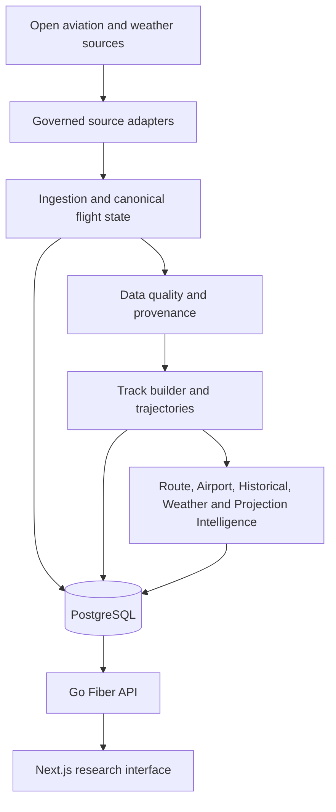

# Global Flight Analytics

[](https://github.com/AsifAbbasov/global-flight-analytics/actions/workflows/backend-ci.yml)
[](https://github.com/AsifAbbasov/global-flight-analytics/actions/workflows/frontend-ci.yml)

Global Flight Analytics is a full-stack open-data aviation research platform built to show
how production engineering, data quality, temporal analytics and explainable inference can
coexist in one coherent product.

It is not air traffic control, navigation guidance, ticketing, a commercial flight status
service or regulated aviation software. Every analytical surface keeps its data window,
confidence, provenance and limitations visible.

<!-- RELEASE-PORTFOLIO-CLOSURE-V1 -->
<!-- BACKEND-OPERATIONS-EVIDENCE-CLOSURE-V1 -->
<!-- RELEASE-TRUTH-DEPLOYMENT-REVISION-V1 -->
<!-- CURRENT-ENGINEERING-STATUS-2026-08-V1 -->
## Current Engineering Status

The heavy backend, PostgreSQL, analytical, API, OpenAPI and frontend-integration work is
closed for the current portfolio scope. Stage 14 is formally closed. Production-provider
recovery and free-tier runtime recovery remain intentionally fail-closed until external
provider confirmation and live post-reset verification can be completed.

```text
ADSB.lol adapter / provider policy        IMPLEMENTED
ADSB.lol production contact               SENT; RESPONSE PENDING
Production Traffic Ingestion              DISPATCH-ONLY / OFFLINE
Cloudflare primary target cadence         30 MINUTES
Cloudflare watchdog target cadence        2 HOURS
Production Metrics Scrape                 2 HOURS
Production Reconciliation                 MANUAL-ONLY WHILE INGESTION OFFLINE
Cloudflare DISPATCH_ENABLED               false
Neon scale-to-zero                        OBSERVED WORKING
Neon monthly quota reset                  2026-09-01T00:00:00Z
Frontend visual and interaction redesign  NEXT PRODUCT PHASE
```

The free-tier deployment profile accepts Render/Neon cold starts instead of using
keep-alive traffic. Cloudflare is the single scheduled owner for future production
ingestion. The GitHub production ingestion workflow is `workflow_dispatch`-only, so there
is no second independent ingestion scheduler waking Render or Neon.

The current free-tier budget and recovery criteria are recorded in
[`docs/194_FREE_TIER_PRODUCTION_INFRASTRUCTURE_BUDGET.md`](docs/194_FREE_TIER_PRODUCTION_INFRASTRUCTURE_BUDGET.md).

<!-- ANALYTICAL-CORE-REVIEW-CLOSURE:README -->
## Analytical Core Review Closure

```text
ANALYTICAL_CORE_REVIEW_STATUS=CLOSED
Open required changes: 0
```

The Analytical Core closure remains immutable repository evidence; current recovery work
does not reopen that completed technical review.

## Portfolio Release Evidence

Source implementation and exact-commit Continuous Integration were closed for the original
portfolio release `49e474e929dcca5b687464f0a47ce73fcd5a52a7`:

- Backend CI run `30715613342` completed successfully;
- Frontend CI run `30715613361` completed successfully.

The production verification completed on 2026-08-02 used application revision
`6bca02a8ed1487195b165ae9ced3ca687a373666`. This is immutable historical evidence for
that verification event, not a claim that mutable production aliases still serve the same
revision:

- Frontend: `https://global-flight-analytics-web.vercel.app`
- API: `https://global-flight-analytics-api.onrender.com`
- Database: owner-controlled Neon PostgreSQL

Historical release verification recorded:

```text
PRODUCTION_RELEASE_SMOKE=PASS
```

Visual and interaction redesign remains a separate product phase. The current frontend is
technically integrated and publicly deployed, but it is not presented as the final visual
design.

<!-- STAGE-13-FRONTEND-ANALYTICS-CLOSURE-V1 -->
## Frontend Analytics Integration

Stage 13 frontend analytics integration is technically complete. Projection Intelligence,
Weather Context and Stability/Explainability are wired through source-backed API/query
contracts and rendered by the product workspace without moving server-owned analytical
recomputation into the browser.

Observed trajectory and estimated projection geometry remain separate MapLibre evidence
sources, so measured history and estimated future geometry cannot be presented as the same
kind of observation. The visual and interaction redesign remains a separate product phase.

Formal completion evidence is preserved in
[`docs/184_STAGE_13_FRONTEND_ANALYTICS_INTEGRATION_COMPLETION.md`](docs/184_STAGE_13_FRONTEND_ANALYTICS_INTEGRATION_COMPLETION.md).

<!-- PRODUCTION-OBSERVABILITY-CLOSURE-V1 -->
## Production Observability

Production observability remains repository-owned and historically verified. Protected
Prometheus-compatible metrics are forwarded through Grafana Alloy to Grafana Cloud; the
stack owns one production SLO dashboard and nine managed alert rules, with controlled
notification delivery recorded as historical closure evidence.

Exact resources, security boundaries and notification-delivery evidence are preserved in
[`docs/170_PRODUCTION_OBSERVABILITY_AND_ALERTING_CLOSURE.md`](docs/170_PRODUCTION_OBSERVABILITY_AND_ALERTING_CLOSURE.md).
The current free-tier metrics cadence is two hours, with a 180-minute missing-metrics
window; that newer cadence does not rewrite the immutable historical closure evidence.

## Production Traffic and Free-Tier Boundary

Historical reliability closure proved the Cloudflare scheduling, watchdog, deduplication,
recovery and exact-revision runtime path on the earlier production profile. Those immutable
runs remain historical evidence.

The current `FREE_V1` profile is intentionally different:

```text
Cloudflare primary:     17,47 * * * *
Cloudflare watchdog:    19 */2 * * *
Metrics scrape:         20 */2 * * *
GitHub ingestion cron:  NONE
GitHub reconciliation:  workflow_dispatch only while ingestion is offline
DISPATCH_ENABLED:       false
```

The old 10-minute primary, 5-minute watchdog, 15-minute metrics keep-awake pattern and
independent 10-minute reconciliation schedule are no longer the current deployment policy.
The production ingestion workflow remains disabled/fail-closed until provider and Neon
recovery criteria are satisfied.

Historical reliability diagnosis and repository-recorded closure evidence are preserved in
[`docs/182_ZERO_COST_PRODUCTION_INGESTION_RELIABILITY.md`](docs/182_ZERO_COST_PRODUCTION_INGESTION_RELIABILITY.md)
and
[`docs/183_CLOUDFLARE_INGESTION_LIVE_DEPLOYMENT_EVIDENCE.md`](docs/183_CLOUDFLARE_INGESTION_LIVE_DEPLOYMENT_EVIDENCE.md).
GitHub Actions retains the immutable execution history; the final validator log remains
owner-local, non-secret supporting evidence and is not committed to the repository.

## Production Provider Recovery — ADSB.lol

The provider recovery implementation uses ADSB.lol as the default open-data provider
candidate. The backend includes a dedicated readsb-compatible ADSB.lol adapter, bounded
request policy, source-specific provenance, provider eligibility gates and fail-closed
fallback selection.

`TRAFFIC_PROVIDER=auto` starts with ADSB.lol. Airplanes.live is eligible only after
compatible access is explicitly approved. OpenSky remains fail-closed for operational use
until the required agreement is explicitly confirmed.

The production-use contact to ADSB.lol has been sent with the intended free-tier profile:
approximately one request every 30 minutes, maximum 250 nautical miles, a project-side
safety cap no greater than one request per minute, ODbL attribution and non-ATC use.
Production activation still waits for the provider response.

```text
ADSBLOL_ADAPTER=IMPLEMENTED
ADSBLOL_PROVIDER_POLICY=IMPLEMENTED
ADSBLOL_PRODUCTION_CONTACT=SENT
ADSBLOL_PRODUCTION_RESPONSE=PENDING
PRODUCTION_WORKFLOW_SOURCE_READY=YES
PRODUCTION_INGESTION=INTENTIONALLY_OFFLINE
PRODUCTION_PROVIDER_RECOVERY=OPEN
```

Implementation details and activation criteria are recorded in
[`docs/193_PRODUCTION_TRAFFIC_PROVIDER_RECOVERY.md`](docs/193_PRODUCTION_TRAFFIC_PROVIDER_RECOVERY.md).

## Free-Tier Infrastructure Recovery

The August 2026 Neon incident was traced to excessive active time / repeated wake windows,
not sustained high compute scaling. Live inspection recorded approximately 373.6 active
hours, approximately 101.2 CU-hours and approximately 0.27 CU average effective compute,
close to the 0.25 CU minimum. Scale-to-zero was observed working after inactivity.

```text
TARGET_MONTHLY_NEON_COMPUTE <= 60 CU-hours
RESERVE_FOR_INTERACTIVE_AND_RECOVERY_WORK >= 40 CU-hours
30-minute ingestion target
2-hour metrics/watchdog
one daily release smoke
no keep-alive traffic
```

The incident remains open until quota availability returns and live production evidence
shows successful ingestion, PostgreSQL persistence, Grafana recovery and bounded sleep /
compute behavior under the new cadence.

## Recent Engineering Milestones — August 2026

- **PR #68 — Frontend dependency security.** Closed the production dependency security
  baseline and permanent dependency-graph protection.
- **PR #69 — Required-check recovery hardening.** Added exact-head, fail-closed CI recovery
  rules and prohibited empty retrigger commits or reduced shadow workflows.
- **PR #70 — Playwright product coverage.** Expanded browser verification to twenty
  deterministic Chromium product journeys and preserved the visual-redesign boundary.
- **PR #82 — ADSB.lol provider recovery.** Added the fail-closed open-data provider path.
- **PR #85 — Free-tier infrastructure hardening.** Reworked monitoring, reconciliation and
  scheduler cadence around the measured Neon compute budget.

## Architecture



The production architecture is a modular monolith. The backend is the authority for
persistence and analytical semantics; the frontend validates transport contracts and
renders evidence without recomputing server-owned analytics.

## What Is Implemented

### Product experience

- regional and world traffic exploration;
- synchronized map, aircraft index and aircraft intelligence;
- Airport Intelligence ranking, passport, completed-day history and trends;
- Historical Intelligence across global, airport and route scopes;
- Projection, Weather Context and Stability/Explainability surfaces;
- deterministic CSV and GeoJSON research exports;
- shareable workspace state, responsive navigation and recoverable errors.

### Analytical platform

- canonical flight-state normalization and PostgreSQL persistence;
- provider budgets, health-aware selection, retry, fallback and ingestion evidence;
- trajectory construction, segmentation, reconciliation and quality contracts;
- Route, Airport, Historical, Weather, Projection and Stability Intelligence;
- materialized analytical records with versioned contracts and provenance;
- repeatable-read snapshot consistency, nullable telemetry integrity and keyset pagination.

### Engineering depth

- Go modular monolith with explicit bounded contexts;
- PostgreSQL migrations, constraints, repositories and repeatable-read boundaries;
- Next.js, React, TypeScript, TanStack Query and MapLibre;
- OpenAPI 3.1 source-backed contract and generated TypeScript client;
- protected mutation routes and unauthenticated read-only research routes;
- GitHub Actions quality gates, CodeQL, API load baseline and Playwright E2E;
- production observability through Prometheus-compatible metrics and Grafana Cloud.

## Contract and Test Surface

The current repository contract exposes **38 source-backed OpenAPI paths**: 37
unauthenticated public read operations and one protected Route Intelligence mutation.

Browser verification contains **twenty deterministic Chromium product journeys** and
**seven deterministic private mock scenarios** covering workspace navigation, aircraft,
airport and analytical surfaces, exports, recovery behavior, accessibility and responsive
layout invariants.

```text
OPENAPI_CONTRACT_PATHS=38
OPENAPI_PUBLIC_READ_OPERATIONS=37
OPENAPI_PROTECTED_MUTATION_OPERATIONS=1
PLAYWRIGHT_E2E_BROWSER_SCENARIOS=20
PLAYWRIGHT_E2E_MOCK_SCENARIOS=7
STAGE_14_OVERALL_STATUS=CLOSED
```

## Technology

| Layer | Technology |
| --- | --- |
| Frontend | Next.js 16, React 19, TypeScript, TanStack Query, MapLibre, Three.js |
| Backend | Go, Fiber, pgx |
| Database | PostgreSQL / Neon |
| Local runtime | Docker Compose |
| Production path | Vercel frontend, Render Docker API, Neon PostgreSQL |
| Scheduling | Cloudflare Worker + dispatch-owned GitHub Actions ingestion |
| Observability | Prometheus metrics, Grafana Alloy, Grafana Cloud dashboards and alerting |

## Run the Local Demo

Prerequisites: Docker Compose v2, Node.js 24.9.0, pnpm 11.8.0 and the Go version declared
by `apps/api/go.mod`.

```bash
docker compose config
docker compose up --build --detach
docker compose ps
```

Verify backend lifecycle endpoints:

```bash
curl --fail --silent --show-error http://127.0.0.1:8080/api/v1/health
curl --fail --silent --show-error http://127.0.0.1:8080/api/v1/ready
curl --fail --silent --show-error http://127.0.0.1:8080/api/v1/version
```

Start the frontend:

```bash
pnpm install --frozen-lockfile
test -f apps/web/.env.local || cp apps/web/.env.example apps/web/.env.local
pnpm dev:web
```

Open `http://localhost:3000`.

## Verify a Release Candidate

Run the complete source gate:

```bash
pnpm verify:release
```

For an explicitly selected deployed revision, the production smoke entry point remains:

```bash
FRONTEND_URL="https://global-flight-analytics-web.vercel.app" \
API_BASE_URL="https://global-flight-analytics-api.onrender.com" \
EXPECTED_API_REVISION='<full deployed API SHA>' \
pnpm smoke:production
```

The release gate covers the portfolio contract, recruiter quickstart, dependency graph,
frontend tests, ESLint, TypeScript, production build, Go formatting/tests/vet, architecture
audits, Docker configuration and repository integrity.

## Reviewer Guide

- [`docs/162_RELEASE_AND_PORTFOLIO_CLOSURE.md`](docs/162_RELEASE_AND_PORTFOLIO_CLOSURE.md) — release definition and production evidence policy;
- [`docs/163_PRODUCTION_DEPLOYMENT_RUNBOOK.md`](docs/163_PRODUCTION_DEPLOYMENT_RUNBOOK.md) — production deployment and recovery path;
- [`docs/164_RECRUITER_DEMO_SCRIPT.md`](docs/164_RECRUITER_DEMO_SCRIPT.md) — product and code walkthrough;
- [`docs/165_SYSTEM_ARCHITECTURE_AND_DECISIONS.md`](docs/165_SYSTEM_ARCHITECTURE_AND_DECISIONS.md) — architecture, boundaries and trade-offs;
- [`docs/170_PRODUCTION_OBSERVABILITY_AND_ALERTING_CLOSURE.md`](docs/170_PRODUCTION_OBSERVABILITY_AND_ALERTING_CLOSURE.md) — managed production observability evidence;
- [`docs/184_STAGE_13_FRONTEND_ANALYTICS_INTEGRATION_COMPLETION.md`](docs/184_STAGE_13_FRONTEND_ANALYTICS_INTEGRATION_COMPLETION.md) — Stage 13 frontend analytics closure;
- [`docs/191_PRODUCTION_INGESTION_RESILIENCE_INCIDENT_CLOSURE.md`](docs/191_PRODUCTION_INGESTION_RESILIENCE_INCIDENT_CLOSURE.md) — provider incident containment;
- [`docs/192_PRODUCTION_RECONCILIATION_ALERT_STABILITY_INCIDENT.md`](docs/192_PRODUCTION_RECONCILIATION_ALERT_STABILITY_INCIDENT.md) — reconciliation incident evidence;
- [`docs/193_PRODUCTION_TRAFFIC_PROVIDER_RECOVERY.md`](docs/193_PRODUCTION_TRAFFIC_PROVIDER_RECOVERY.md) — ADSB.lol recovery implementation;
- [`docs/194_FREE_TIER_PRODUCTION_INFRASTRUCTURE_BUDGET.md`](docs/194_FREE_TIER_PRODUCTION_INFRASTRUCTURE_BUDGET.md) — free-tier compute budget and current recovery state;
- [`docs/DOCUMENT_INDEX.md`](docs/DOCUMENT_INDEX.md) — complete engineering record.

## Remaining Portfolio v1.0.0 Work

The next active engineering increment is **Frontend Product Closure**. Provider and Neon
recovery are now external/runtime verification tracks rather than reasons to keep extending
the backend architecture.

Remaining sequence:

1. complete the Frontend Visual and Interaction Redesign;
2. stabilize final pixel-golden Playwright screenshot baselines after the redesign;
3. receive ADSB.lol production-use confirmation;
4. after Neon quota availability returns, run controlled production ingestion and verify
   PostgreSQL write, freshness, Grafana evidence and scale-to-zero behavior;
5. perform final exact-production deployment validation against the release revision;
6. refresh final release documentation and publish `v1.0.0`.

```text
FRONTEND_PRODUCT_CLOSURE=NEXT
FRONTEND_VISUAL_AND_INTERACTION_REDESIGN=OPEN
PIXEL_GOLDEN_VISUAL_REGRESSION=OPEN
PRODUCTION_PROVIDER_RECOVERY=OPEN_EXTERNAL
FREE_TIER_INFRASTRUCTURE_RECOVERY=OPEN_RUNTIME_VALIDATION
FINAL_EXACT_PRODUCTION_VALIDATION=OPEN
FINAL_RELEASE_DOCUMENTATION=OPEN
V1_RELEASE=OPEN
```

## Evidence Boundaries

The project uses open and incomplete observations. It does not invent filed flight plans,
confirmed incidents, operational airport capacity, safety guarantees or authoritative
flight status. Missing evidence remains missing; unavailable comparisons are not converted
into zero; optional identity fields do not invalidate positional evidence.

Machine learning, satellite fusion, billing, authentication, Kubernetes and microservices
remain outside the current portfolio release boundary.

<!-- SOURCE-CONSTRAINTS-OPENSKY-V1 -->
