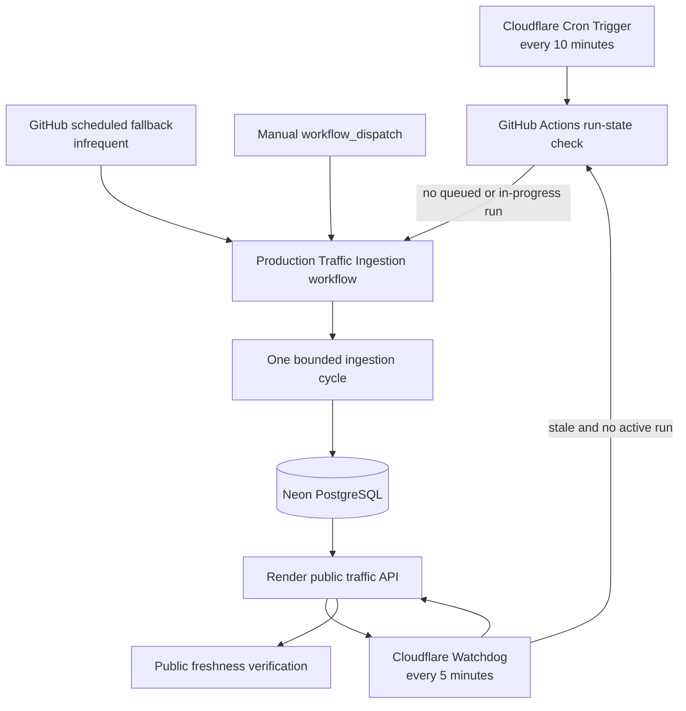

# Production Deployment Runbook

<!-- RELEASE-TRUTH-DEPLOYMENT-REVISION-V1 -->

## Purpose

This runbook deploys the complete production path without changing the application
architecture:

- Neon PostgreSQL;
- the Dockerized Go API on Render;
- the Next.js frontend on Vercel;
- exact-origin Cross-Origin Resource Sharing between the frontend and API;
- production migration, lifecycle, revision, frontend, and browser integration smoke.

Do not commit database passwords, mutation keys, metrics keys, provider credentials,
deployment tokens, or private connection strings. Configure them in platform secret
stores.

## Verified production deployment

The deployment completed on 2026-08-02 with these public endpoints:

- Frontend: `https://global-flight-analytics-web.vercel.app`
- API: `https://global-flight-analytics-api.onrender.com`

Evidence revisions:

- historically verified production application SHA (2026-08-02): `6bca02a8ed1487195b165ae9ced3ca687a373666`;
- production migration evidence SHA: `31deab02507adc49bd296761d1551834e214b768`.

Verified markers:

```text
PRODUCTION_DATABASE_MIGRATION=PASS
PRODUCTION_API_SMOKE=PASS
PRODUCTION_FRONTEND=PASS
PRODUCTION_API_HEALTH=PASS
PRODUCTION_API_READINESS=PASS
PRODUCTION_API_VERSION=PASS
PRODUCTION_CORS=PASS
PRODUCTION_RELEASE_SMOKE=PASS
```

The current frontend is technically deployed and integrated. Visual redesign remains a
separate product phase and is not part of this deployment runbook.

## 1. Freeze the release candidate

```bash
git status -sb
git rev-parse HEAD
pnpm verify:release
pnpm verify:backend-operations-contract
```

Record the source candidate SHA separately from the deployment revision. After Render
selects or completes a deployment, copy the full SHA from Render deployment metadata into
`DEPLOYED_API_REVISION`. Use that explicit value for the API revision check and full
production smoke. Do not infer the deployed revision from the current local `HEAD`; the
repository may advance independently. A migration may be executed from an earlier compatible
SHA when later commits do not change the migration catalog; record every revision explicitly.

## 2. Create Neon PostgreSQL

Create one project and keep two TLS connection strings:

- a direct connection string for migrations and maintenance;
- a pooled connection string for the running API.

Run migrations from a clean checkout with the direct URL:

```bash
PRODUCTION_DATABASE_MIGRATION_URL='paste the direct Neon URL in this terminal only' \
EXPECTED_RELEASE_SHA="$(git rev-parse HEAD)" \
pnpm migrate:production-database
```

The command rejects Neon hostnames containing `-pooler`, requires TLS, and delegates to
the production `cmd/migrate` path. Do not place the direct URL in source control or shared
shell history.

Required successful markers include:

```text
PRODUCTION_DATABASE_MIGRATION_SHA=<full expected SHA>
PRODUCTION_DATABASE_MIGRATION=PASS
MIGRATION_COMMAND_EXIT=0
```

## 3. Create the Render Blueprint

The root `render.yaml` defines one free Render web service:

| Setting | Value |
| --- | --- |
| Runtime | Docker |
| Plan | Free portfolio service |
| Region | Frankfurt |
| Dockerfile | `apps/api/Dockerfile` |
| Build context | repository root |
| Health check | `/api/v1/ready` |
| Port | `API_PORT=10000` |
| Auto deploy | after linked checks pass |

During initial Blueprint creation, supply:

```text
DATABASE_URL=<pooled Neon URL>
API_ALLOWED_ORIGINS=<temporary valid HTTPS origin until Vercel is deployed>
API_MUTATION_KEY_SHA256=<owner-generated lowercase SHA-256 digest>
METRICS_KEY_SHA256=<owner-generated lowercase SHA-256 digest>
```

The free Render web service does not support a pre-deploy command. Run
`pnpm migrate:production-database` before the initial deploy and before deploying any
commit that adds a migration.

A paid Render service may instead define a pre-deploy command that runs `/app/migrate`
with a direct database URL. Do not add that command to the free Blueprint because it
would document a capability unavailable on the current plan.

## 4. Deploy and verify the API

Render supplies `RENDER_GIT_COMMIT` during the Docker build. The Dockerfile uses it only
when an explicit `VCS_REF` build argument is absent, preserving local and Continuous
Integration behavior.

After the service is live and `/api/v1/ready` returns `200`, run:

```bash
DEPLOYED_API_REVISION='<full SHA from the intended Render deployment>'
API_BASE_URL=https://global-flight-analytics-api.onrender.com \
EXPECTED_API_REVISION="$DEPLOYED_API_REVISION" \
pnpm smoke:api-production
```

Required markers:

```text
PRODUCTION_API_HEALTH=PASS
PRODUCTION_API_READINESS=PASS
PRODUCTION_API_VERSION=PASS
PRODUCTION_API_REVISION=PASS
PRODUCTION_API_SMOKE=PASS
```

A `404` response for `/` is expected because the production lifecycle routes are under
`/api/v1/`.

## 5. Deploy Next.js on Vercel

Import the monorepo with these settings:

| Setting | Value |
| --- | --- |
| Framework | Next.js |
| Root Directory | `apps/web` |
| Production branch | `main` |
| Environment variable | `NEXT_PUBLIC_API_BASE_URL` |
| Environment value | `https://global-flight-analytics-api.onrender.com` |

Keep default Next.js build, install, and output settings unless the build log identifies a
specific monorepo problem.

After deployment, select the stable project production domain rather than a unique
commit-specific preview URL. The verified production origin is:

```text
https://global-flight-analytics-web.vercel.app
```

## 6. Close exact-origin CORS

In Render, replace the temporary `API_ALLOWED_ORIGINS` value with the exact Vercel
production origin:

```text
https://global-flight-analytics-web.vercel.app
```

The value must contain only the origin:

- no trailing slash;
- no path;
- no query parameters;
- no fragment;
- no `Value:` label;
- no quotation marks.

Save, rebuild, and deploy the Render service. Confirm PostgreSQL connection establishment,
API startup, and repeated `/api/v1/ready status=200` logs.

## 7. Run the full production smoke

```bash
DEPLOYED_API_REVISION='<full SHA from the intended Render deployment>'
FRONTEND_URL="https://global-flight-analytics-web.vercel.app" \
API_BASE_URL="https://global-flight-analytics-api.onrender.com" \
EXPECTED_API_REVISION="$DEPLOYED_API_REVISION" \
pnpm smoke:production
```

Required markers:

```text
PRODUCTION_FRONTEND=PASS
PRODUCTION_API_HEALTH=PASS
PRODUCTION_API_READINESS=PASS
PRODUCTION_API_VERSION=PASS
PRODUCTION_CORS=PASS
PRODUCTION_RELEASE_SMOKE=PASS
```

This command verifies frontend identity, API lifecycle, exact build provenance, and the
exact `Access-Control-Allow-Origin` response together.

## 8. Scheduled production smoke

The repository contains `.github/workflows/production-smoke.yml`. It runs once per day and
can also be started manually. The workflow verifies the public Vercel frontend, Render API
lifecycle endpoints, exact Cross-Origin Resource Sharing response, and exact API build
revision through the existing `scripts/smoke-production-release.sh` contract.

Create this GitHub Actions repository variable before enabling the scheduled evidence:

```text
PRODUCTION_API_REVISION=<full lowercase SHA copied from the intended Render deployment>
```

The variable is public deployment metadata, not a credential. Update it only after the new
Render deployment has been independently identified and manually verified. A manual workflow
run may provide `expected_api_revision` as an explicit temporary override. The workflow does
not infer the deployed revision from local `HEAD` or `github.sha`; source state and deployment
state remain separate facts.

Required successful markers include:

```text
PRODUCTION_SMOKE_REVISION_INPUT=PASS
PRODUCTION_RELEASE_SMOKE=PASS
SCHEDULED_PRODUCTION_SMOKE=PASS
```

A failed scheduled run is operational evidence that the public path, Cross-Origin Resource
Sharing configuration, or recorded deployment revision requires investigation. It does not
automatically redeploy, migrate the database, or change repository state.

## 8.1 Production traffic ingestion scheduler boundary and recovery

Production traffic ingestion uses the deployed Cloudflare Worker as the
primary timing authority:

```text
PRIMARY_CRON=3,13,23,33,43,53 * * * *
WATCHDOG_CRON=*/5 * * * *
```

The repository workflow
`.github/workflows/production-traffic-ingestion.yml` remains the isolated
bounded ingestion executor and declares the offset hourly fallback plus the
manual recovery path:

```yaml
schedule:
  - cron: '37 * * * *'
workflow_dispatch:
```

GitHub-hosted scheduling is therefore a cross-provider fallback, not the
ten-minute production timing authority.

### Observed production incident

During live runtime validation on 2026-08-06, the API served a traffic snapshot with:

```text
age_seconds=18189
maximum_age_seconds=1800
```

The approximately five-hour gap was investigated before recovery. Historical and manual
workflow evidence established that:

- `PRODUCTION_INGESTION_DATABASE_URL` was configured;
- the Airplanes.live request path succeeded;
- bounded ingestion cycles stored flight states and trajectories;
- the public API read from the same production database;
- exact application revision, Vercel deployment, Render deployment, health, readiness,
  version, and Cross-Origin Resource Sharing checks passed;
- no application, database-schema, provider-authentication, or secret failure explained the
  missing scheduled executions.

The operational classification is therefore a scheduled-execution gap, not a data-path or
application-code failure.

### Recovery procedure

Recovery must preserve exact revision evidence and must not edit the database manually.

1. Confirm a clean `main` checkout synchronized with `origin/main`.
2. Dispatch **Production Traffic Ingestion** manually against `main`.
3. Record the workflow run ID, event, head SHA, ingestion counts, and freshness result.
4. Require `PRODUCTION_TRAFFIC_FRESHNESS=PASS`.
5. Rerun the exact-revision live production runtime validator.

A minimal manual dispatch is:

```bash
gh workflow run production-traffic-ingestion.yml --ref main
```

Then identify and watch the created run:

```bash
gh run list --workflow production-traffic-ingestion.yml --event workflow_dispatch --branch main
gh run watch '<run-id>' --exit-status
gh run view '<run-id>' --log
```

The verified recovery run was:

```text
RUN_ID=31076668920
EVENT=workflow_dispatch
HEAD_SHA=855f82bf97cf0db47d1a3918f75ea70f7f2b06fe
stored=4
trajectories=4
PRODUCTION_TRAFFIC_FRESHNESS=PASS
age_seconds=5
```

After recovery, the complete live validator produced:

```text
PRODUCTION_TRAFFIC_DATA=PASS
PRODUCTION_OPENAPI_LIVE_PARITY=PASS
PRODUCTION_OPENAPI_ETAG=PASS
PRODUCTION_OPENAPI_CONDITIONAL_GET=PASS
PRODUCTION_MUTATION_AUTHENTICATION_BOUNDARY=PASS
VALIDATION_NON_MUTATING=PASS
LIVE_PRODUCTION_RUNTIME_VALIDATION=PASS
```

### Resolution status

The manual dispatch restored service freshness and closed the original
exact-revision validation incident. The scheduler reliability boundary was
subsequently removed by the Cloudflare primary scheduler, five-minute
watchdog, offset GitHub fallback, live duplicate-suppression proof, and final
exact-revision runtime validation recorded below.

### Selected zero-cost MVP reliability architecture

The selected design removes GitHub scheduled execution from the primary timing role while
retaining the already verified GitHub workflow as the isolated ingestion executor.

```text
Cloudflare Cron Trigger — primary scheduler
          |
          | every 10 minutes
          v
GitHub workflow_dispatch
          |
          v
Production Traffic Ingestion
          |
          +-- one bounded ingestion cycle
          +-- write to Neon PostgreSQL
          +-- verify public freshness


Cloudflare Watchdog — every 5 minutes
          |
          +-- request /api/v1/traffic/current
          +-- detect stale observations
          +-- check that no workflow run is queued or in progress
          +-- redispatch workflow_dispatch only when recovery is required


GitHub scheduled fallback — infrequent, for example hourly
          |
          +-- secondary recovery path if Cloudflare scheduling is unavailable


Manual final fallback
gh workflow run production-traffic-ingestion.yml --ref main
```

The same design can be rendered as a dependency diagram:



### Responsibility split

| Component | Responsibility | Must not do |
| --- | --- | --- |
| Cloudflare primary trigger | request one GitHub workflow dispatch every ten minutes | ingest data directly or store database credentials |
| Cloudflare watchdog | verify public freshness and request recovery only when stale | create duplicate runs while one is queued or active |
| GitHub ingestion workflow | execute the existing bounded ingestion command and verify the public result | become the only scheduler or silently accept stale data |
| GitHub scheduled fallback | provide an infrequent cross-provider fallback | claim an exact hourly or ten-minute availability guarantee |
| Manual dispatch | provide the final owner-controlled recovery path | replace automated detection and recovery |
| Neon PostgreSQL | persist ingestion runs, canonical states, and trajectories | act as an external scheduler |

### Duplicate-run and failure controls

Before Cloudflare requests a dispatch, it must query recent runs for
`production-traffic-ingestion.yml`. A new dispatch is permitted only when:

- no run is `queued` or `in_progress`;
- the primary schedule is due, or public data exceeds the recovery freshness threshold;
- the previous dispatch is outside a bounded deduplication interval.

The GitHub workflow keeps its existing concurrency group:

```yaml
concurrency:
  group: production-traffic-ingestion
  cancel-in-progress: false
```

This protects execution after dispatch. The Cloudflare run-state check prevents unnecessary
queue growth before dispatch. Public freshness verification remains the final success
condition; a completed workflow is not sufficient evidence when the API still serves stale
or empty traffic.

### Secret and access boundary

Cloudflare must store the GitHub credential only as an encrypted Worker secret. The
credential must:

- be restricted to the `global-flight-analytics` repository;
- have only the permissions required to read Actions state and dispatch the selected workflow;
- never appear in source, `wrangler.toml`, logs, README examples, or GitHub variables;
- be rotated when it expires or when access scope changes.

Cloudflare does not receive the Neon connection string, provider credentials, Render
environment variables, API mutation key, or Grafana credentials. Production database
access remains confined to the existing GitHub ingestion workflow and Render API.

### Deployment truth and closure evidence

Cloudflare live deployment status: verified on 2026-08-06. The Worker source, tests,
Wrangler configuration, authorization boundary, deployment sequence, and initial live
evidence are recorded in `docs/182_ZERO_COST_PRODUCTION_INGESTION_RELIABILITY.md` and
`docs/183_CLOUDFLARE_INGESTION_LIVE_DEPLOYMENT_EVIDENCE.md`.

The complete reliability evidence is now recorded:

```text
CLOUDFLARE_PRIMARY_SCHEDULE=PASS
CLOUDFLARE_PRIMARY_REAL_DISPATCH=PASS
CLOUDFLARE_WATCHDOG=PASS
CLOUDFLARE_GITHUB_AUTHORIZATION_BOUNDARY=PASS
RECENT_SUCCESS_DEDUPLICATION=PASS
ACTIVE_RUN_DEDUPLICATION=PASS
STALE_TRAFFIC_RECOVERY_DISPATCH=PASS
GITHUB_SCHEDULED_FALLBACK=PASS
MANUAL_RECOVERY=PASS
POST_RECOVERY_PUBLIC_FRESHNESS=PASS
LIVE_PRODUCTION_RUNTIME_VALIDATION=PASS
PRODUCTION_INGESTION_RELIABILITY=PASS
```

Exact live run identities:

```text
CLOSURE_REPOSITORY_REVISION=7dfc66685247a5a1aaea87b1391624d1014d7013
WATCHDOG_RECOVERY_RUN_ID=31103550357
PRIMARY_DISPATCH_RUN_ID=31112274607
PRIMARY_DISPATCH_HEAD_SHA=7dfc66685247a5a1aaea87b1391624d1014d7013
ACTIVE_RUN_AND_FALLBACK_RUN_ID=31113114700
ACTIVE_RUN_AND_FALLBACK_HEAD_SHA=7dfc66685247a5a1aaea87b1391624d1014d7013
FINAL_RUNTIME_VALIDATION_SHA=7dfc66685247a5a1aaea87b1391624d1014d7013
FINAL_RUNTIME_VALIDATION_COMPLETED_AT=2026-08-06T15:31:58Z
```

### Evidence ownership and verification boundary

The repository records the exact run identities, closure revision, validation
timestamp, and stable `PASS` markers. GitHub Actions retains the immutable run
history. The final read-only validator log is owner-local, non-secret supporting
evidence and is intentionally not committed.

The repository verifier proves documentation consistency and prevents regression
to stale `PENDING` claims. It does not independently recreate the historical
Cloudflare or production runtime events.

Cloudflare is the primary scheduler. GitHub Actions remains an offset hourly
fallback at `37 * * * *`, and manual dispatch remains the final recovery path.
The production ingestion reliability stage is closed.

## 9. External Grafana Cloud metrics scraper

The repository contains `.github/workflows/production-metrics-scrape.yml` and
`monitoring/grafana-cloud/config.alloy`. The workflow runs four times per hour on an external
GitHub-hosted runner. Grafana Alloy authenticates to the protected Render
`/internal/metrics` endpoint, performs several bounded Prometheus scrapes, and forwards the
samples to Grafana Cloud through `prometheus.remote_write`.

Create a Grafana Cloud stack and copy the Prometheus connection details. Configure these
GitHub Actions secrets:

```text
PRODUCTION_METRICS_KEY=<random plaintext key used only by the external scraper>
GRAFANA_CLOUD_PROMETHEUS_URL=<full HTTPS remote-write URL>
GRAFANA_CLOUD_PROMETHEUS_QUERY_URL=<full HTTPS instant-query URL>
GRAFANA_CLOUD_PROMETHEUS_USER=<Grafana Cloud metrics username or tenant ID>
GRAFANA_CLOUD_API_KEY=<token with metrics write and query access>
```

Keep the existing repository variable synchronized independently:

```text
PRODUCTION_API_REVISION=<full lowercase SHA copied from the intended Render deployment>
```

Hash the plaintext production metrics key locally and configure only the digest in Render:

```bash
printf '%s' "$PRODUCTION_METRICS_KEY" | shasum -a 256
```

Set the resulting lowercase digest as `METRICS_KEY_SHA256`. Never place the plaintext key in
Render source files, repository variables, logs, or documentation. The GitHub secret and the
Render digest must describe the same key.

Run **Production Metrics Scrape** manually after configuration. A successful execution must
produce:

```text
PRODUCTION_METRICS_INPUT=PASS
PRODUCTION_METRICS_SOURCE_PREFLIGHT=PASS
GRAFANA_ALLOY_CONFIG=PASS
GRAFANA_CLOUD_REMOTE_WRITE=PASS
GRAFANA_CLOUD_QUERY_EVIDENCE=PASS
```

The final query checks that Grafana Cloud contains `global_flight_analytics_build_info` with
the exact `deployment_revision` label. This proves that metrics were scraped outside the
application host, accepted by the external time-series store, and remain tied to explicit
deployment truth. Dashboard and alert provisioning are handled by the next observability
increment; this transport workflow does not claim that alert delivery is already configured.

## 10. Grafana SLO dashboard and alert provisioning

The repository contains `.github/workflows/provision-grafana-observability.yml`, the versioned
Grafana resources in `monitoring/grafana-cloud`, and an idempotent provisioning script. The
workflow creates or updates the `gfa-observability` folder, the `gfa-production-slo` dashboard,
and nine bounded production alert rules.

Configure these GitHub Actions repository variables:

```text
GRAFANA_INSTANCE_URL=<Grafana Cloud stack URL, for example https://example.grafana.net>
GRAFANA_STACK_ID=<numeric Grafana Cloud stack ID used for the stacks-<ID> API namespace>
GRAFANA_PROMETHEUS_DATASOURCE_UID=<UID of the Grafana Cloud Prometheus datasource>
GRAFANA_EXPECTED_RECEIVER=<optional exact receiver name from the default notification policy>
```

Configure this GitHub Actions secret:

```text
GRAFANA_SERVICE_ACCOUNT_TOKEN=<Grafana service-account token with folder, dashboard, alert-rule, and policy-read permissions>
```

Run **Provision Grafana Observability** manually. Required evidence markers are:

```text
GRAFANA_PROVISION_INPUT=PASS
GRAFANA_OBSERVABILITY_RENDER=PASS
GRAFANA_FOLDER=PASS
GRAFANA_SLO_DASHBOARD=PASS
GRAFANA_ALERT_RULES=PASS
GRAFANA_NOTIFICATION_POLICY=PASS
GRAFANA_OBSERVABILITY_PROVISION=PASS
GRAFANA_OBSERVABILITY_WORKFLOW=PASS
```

The dashboard includes availability, latency, server-error ratio, ingestion freshness,
consecutive ingestion failures, PostgreSQL pool utilization, reconciliation backlog,
collector health, traffic throughput, and provider outcome panels. Every panel can be filtered
by explicit `deployment_revision` evidence.

The provisioned rules implement the initial objectives from the backend observability closure:
99.5% availability, two-second p95 latency, one-percent server-error ratio, 120-second ingestion
freshness, three consecutive ingestion failures, 80% PostgreSQL pool utilization, 300-second
reconciliation backlog, collector health, and a separate missing-metrics alert.

The script reads the existing notification policy but never overwrites it. A successful
`GRAFANA_NOTIFICATION_POLICY=PASS` marker proves only that a receiver is routed. Complete
notification delivery evidence additionally requires a contact-point test and one controlled
test alert received through the selected destination. Record the receiver, timestamp, and
resolved notification without committing recipient addresses or tokens.

## 11. Free-tier operational boundary

The Render free instance can spin down after inactivity and may delay the first request by
approximately fifty seconds or more. The smoke commands use bounded retries so the first
request can wake the service before lifecycle validation. This is a latency limitation,
not a deployment or database-integrity failure.

## 12. Rollback

1. select the previous successful API deployment;
2. retain the latest forward-compatible database schema;
3. set `EXPECTED_API_REVISION` to the rollback revision;
4. rerun `pnpm smoke:api-production`;
5. verify the frontend against the rollback API origin;
6. record the reason, exact revision, and smoke evidence.

## Platform references

- Render Blueprint specification: `https://render.com/docs/blueprint-spec`
- Render free-service limitations: `https://render.com/docs/free`
- Render health checks: `https://render.com/docs/health-checks`
- Neon connection pooling: `https://neon.com/docs/connect/connection-pooling`
- Vercel monorepos: `https://vercel.com/docs/monorepos`
