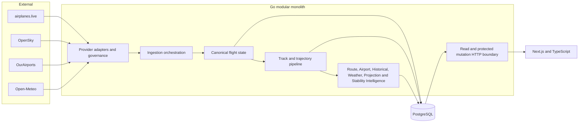

# System Architecture and Decisions

## System shape

Global Flight Analytics is a modular monolith with one browser application, one Go API
runtime and one PostgreSQL database.

## Runtime boundaries

### Provider boundary

External responses are untrusted. Adapters enforce bounded bodies, timeouts, parsing,
field availability and provider identity. Budget, health, retry and fallback decisions
remain separate from transport decoding.

### Canonical data boundary

The canonical Flight State preserves missing telemetry as missing. Zero velocity, zero
altitude and false on-ground state remain valid only when actually observed. Persistence
constraints prevent impossible parent and terminal state combinations.

### Analytical boundary

Analytical modules consume immutable snapshots or bounded read models. Results publish
schema versions, source windows, input fingerprints, confidence, provenance and
limitations. Multi-query Projection reads use one repeatable-read PostgreSQL snapshot.

### HTTP boundary

Read-only research endpoints are public. State-changing or computation-triggering routes
require a backend-only mutation key digest. Handlers map domain errors to stable response
codes and never expose raw infrastructure errors.

### Frontend boundary

The Next.js client validates transport shapes at runtime, uses typed query hooks and
renders server-owned semantics. Browser models are limited to presentation, filtering,
deterministic sorting, current-snapshot quality checks and export formatting.

## Why a modular monolith

The project has many domains but one owner and one deployment unit. A modular monolith
provides package boundaries, explicit contracts and independent tests without introducing
service discovery, network failure, distributed tracing, duplicated authentication,
version skew or cross-service transactions.

## Why not microservices

Microservices would be justified only when independently owned domains require separate
release cadence, scaling or isolation. None of those conditions currently outweigh the
cost. The code is structured so a domain can be extracted later, but extraction is not
performed speculatively.

## Why PostgreSQL

PostgreSQL supplies:

- transactional migrations and constraints;
- exact relational identity;
- repeatable-read analytical snapshots;
- keyset pagination;
- JSON payload persistence where versioned aggregates require it;
- indexes that can be verified with execution plans;
- one durable source of truth for the portfolio MVP.

No Redis cache is required for correctness. No coordinate flood is stored without a
bounded trajectory and retention policy.

## Why backend-owned analytics

Ranking, comparison, confidence and inference formulas remain in Go so every consumer
observes the same contract. Reimplementing formulas in the browser would create drift and
make evidence difficult to audit. Frontend runtime validators reject malformed responses
without changing their meaning.

## Reliability decisions

- caller-owned contexts reach every database operation;
- cleanup uses independent bounded contexts only where cancellation must not prevent
  rollback or release;
- ingestion runs preserve attempt, selected-provider and terminal evidence;
- provider budgets are durable across processes;
- retries are bounded and classification-aware;
- route and historical pagination use complete ordering keys;
- release images run as a non-root user in a scratch filesystem;
- build version, revision and date are exposed through the version endpoint.

## Evidence boundary

The system cannot know more than its inputs. It does not claim filed flight plans,
confirmed incidents, complete global coverage, operational airport capacity or safety
fitness. Probable endpoints, incomplete series, stale observations and provider limits
remain visible in the result contract and user interface.

## Deliberately excluded complexity

The portfolio MVP excludes Kubernetes, Redis, microservices, paid proprietary feeds,
machine-learning claims, authentication, billing, mobile clients and safety-critical
operation. Those are product decisions, not missing checkboxes.
